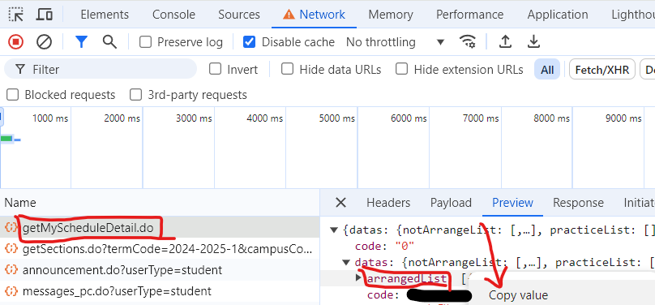

# BUAA-ICS-GEN

Get the .json file yourself, then run the script to generate the calendar file.



```shell
python3 ics_gen.py <json> <first_day_of_semester in yyyy-mm-dd> 
# for example
python3 ics_gen.py arrangedList.json 2024-09-02
```